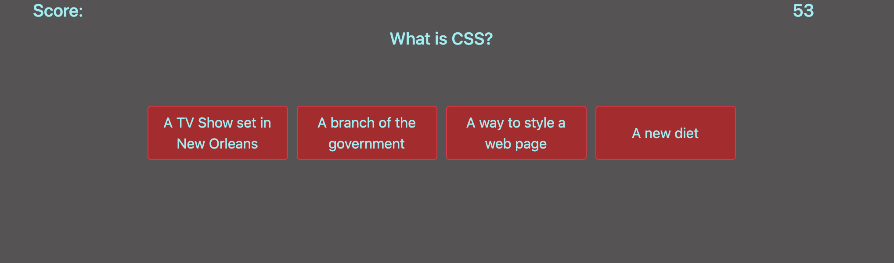

# Code-Quiz

## Description

This application tests your coding knowledge. You click the start quiz button and you will get asked 6 questions about coding. You will have 60 seconds to complete the quiz. Everytime you get a wrong answer, 5 seconds is deducted. Your final score will populate when you have finished the quiz or time has run out.

## Table of Contents

* [Installation](#installation)
* [Usage](#usage)
* [Questions](#questions)

## Installation

No installation needed, just open the page and go.

## Usage

Use this to test your coding knowledge.

## Questions

Here is the link to my GitHub: [Username](Here's a link)

If you have any further questions, please reach out to me via email at: chappand@gmail.com

## Screenshot

Here is a screenshot of the app:
